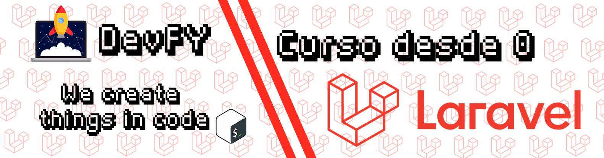

# laravel-desde-cero

# Curso de Laravel 🚀👋🤟💻

## Lista de contenidos

1.  **[Presentacion e Introducción]()**
2.  **[¿Que es Laravel? Introducción al framework](introduccion-al-framework/laravel.md)**
3.  **[Instalación y Configuración - Windows y Linux](#Windows)** 🔧⚙️
    1.  **[Windows](instalacion-configuracion/windows.md)**
    2.  **[Linux](instalacion-configuracion/linux.md)**
4.  **[Laravel Routes](laravel-routes/routes.md)** 🗺️
5.  **[Controladores](laravel-controllers/controllers.md)** 🕹️
6.  **[Resource Controllers](laravel-controllers/controllers.md#resource-controllers)**
7.  **[Vistas](laravel-vistas/Vistas.md)** 📝
8.  **[Laravel Artisan]()** ⚒️
9.  **[Bases de datos]()** 💾
10.  **[Migraciones]()** 💽
11.  **[Modelos]()**
12.  **[Query Builder]()**
13.  **[Eloquent]()**
14.  **[Laravel Relationships]()**
15.  **[CRUD]()**
16.  **[Laravel Auth]()** 🔐
17.  **[Manejo de Sesiones]()**
18.  **[Middlewares]()**
19.  **[Seeders]()**
20.  **[Laravel Email]()** 📧
21.  **[Creación de Blog]()**
22.  **[Deploy]()**
